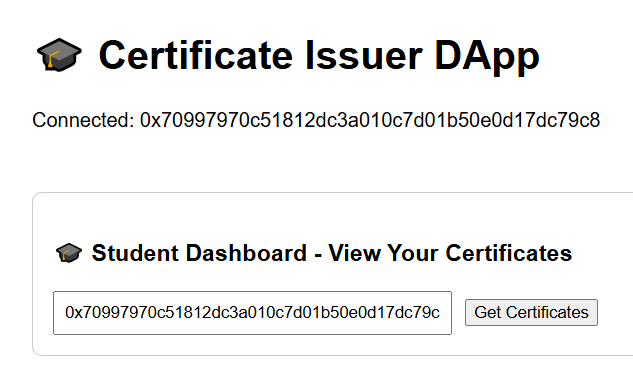

# Certificate-issuer-dapp

A blockchain-based DApp for securely issuing, viewing, and revoking student certificates with role-based access for Admin and Students

# 🎓 Certificate Issuer DApp

A simple and secure decentralized application (DApp) to issue, view, and revoke student certificates using Ethereum smart contracts.

---

## 🎯 Project Objective

The goal of this project is to create a **decentralized certificate issuing system** where:

- **Admins** (like teachers or institutions) can securely **issue**, **view**, and **revoke** certificates on the blockchain.
- **Students** can **view** their certificates anytime by simply connecting their wallet.

This ensures:
- ✅ Certificates are **tamper-proof** and **verifiable** by anyone.
- 🛡️ Trust is maintained without relying on a central server.
- 🧑‍🎓 Students **own their credentials** in their own wallet.

The app is simple, transparent, and easy to use for both admins and students.

---

## 🚀 Key Features

- ✨ Ethereum smart contract to issue and revoke certificates stored on the blockchain.

- ⚛️ React frontend with:

    👩‍🏫 **Admin Panel**
     - Issue new certificates to student addresses
     - View all certificates of a student
     - Revoke a certificate by index

    👨‍🎓 **Student Dashboard**
     - View all certificates issued to the connected wallet address

- 🔐 Metamask integration for wallet connectivity.

- 🧪 Local blockchain development using Hardhat.


---


## 🖼️ Screenshots




---

## 🛠 Tech Stack

- **Frontend:** React + Ethers.js
- **Smart Contract:** Solidity (deployed on local or test Ethereum network)
- **Wallet:** MetaMask

---

## 📦 How to Run the Project

1. **Clone the repository**
   ```bash
   git clone https://github.com/Rumpa-Dey/Certificate-issuer-dapp.git
   cd Certificate-issuer-dapp
 2. **Install dependencies**
     ```bash
    npm install
3. **Start the React app**
   ```bash
   npm start
   ```
   This will start the React app on http://localhost:3000

4. **Start the Hardhat local blockchain (in another terminal)**

```bash
   npx hardhat node

```
5. **Deploy the contract to the local network**

```bash
   npx hardhat run scripts/deploy.js --network localhost

```

6. **Connect MetaMask to your local Hardhat network**

## 📄 Smart Contract

Smart contract file: CertificateIssuer.sol

- issueCertificate(address student, string studentName, string courseName)

- getCertificates(address student)

- revokeCertificate(address student, uint index)

- Uses onlyOwner modifier for admin-restricted functions.


## ⚠️ Important Notes

To run and test this DApp locally with Hardhat:

- The **Admin** is the first account (deployer) from Hardhat when the contract is deployed.
- Only the Admin can **issue** and **revoke** certificates.
- **Student address** must be one of the 20 accounts generated by Hardhat when running (`npx hardhat node`)
- Connect MetaMask to the correct local account (Admin or Student) before using the app.

## 📃 License

This project is licensed under the MIT License.


 

